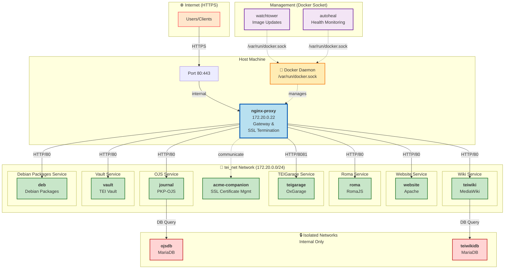

# TEI Infrastructure

Scripts and tools for running the TEI infrastructure.

## Infrastructure setup overview

The directory `humanum` contains Docker Compose files for TEI services 
running on the Huma-Num host.  
Most public services attach to the shared external network `tei_net` and 
are exposed through a central reverse proxy.

### Core stack (`docker-compose_tei-core-services.yml`)

The core compose file provides shared infrastructure used by all other 
service stacks:

- **`nginx-proxy`**  
  Central reverse proxy (ports `80` and `443` on the host).  
  It discovers backend containers via Docker metadata  and routes requests 
  by `VIRTUAL_HOST` / `VIRTUAL_PORT`.

- **`acme-companion`**  
  Manages Let’s Encrypt certificates for hosts declared with `LETSENCRYPT_HOST`.  
  Shares certificate/html volumes with `nginx-proxy`.

- **`autoheal`**  
  Restarts containers marked with label `autoheal=true` when they become 
  unhealthy.  
  It is **not** on `tei_net` (`network_mode: none`) and works via 
  `/var/run/docker.sock`.
> [!IMPORTANT]  
> Services need a [Docker healthcheck instruction](https://dockerbuild.com/reference/healthcheck)
> for the autoheal feature to work.

- **`watchtower`**  
  Polls for newer container images every 30 minutes 
  (`WATCHTOWER_POLL_INTERVAL=1800`) and updates running containers 
  automatically. 
  It also uses `/var/run/docker.sock` and is configured with cleanup enabled 
  to remove stopped containers and unused images.

### How request routing works

1. Public DNS points hostnames (e.g. `tei-c.org`, `journal.tei-c.org`) to this server.
2. Incoming HTTP(S) traffic reaches `nginx-proxy` on host ports `80/443`.
3. `nginx-proxy` forwards requests to the target container on `tei_net` based on `VIRTUAL_HOST`.
4. Certificates are provisioned/renewed by `acme-companion`.

### Requirements for a public service compose file

To be reachable from the internet, a service should:

- join network `tei_net`
- set `VIRTUAL_HOST=<hostname[,hostname2,...]>`
- set `LETSENCRYPT_HOST=<hostname[,hostname2,...]>`
- set `VIRTUAL_PORT=<internal-port>` when not using container port `80`

Optional resilience:

- add label `autoheal: "true"` so `autoheal` can restart unhealthy containers
- if you want to disable the automated update of containers by watchtower 
  you have to explicitly opt out by adding your container to the 
  `WATCHTOWER_DISABLE_CONTAINERS` env variable.

## Architectural overview

